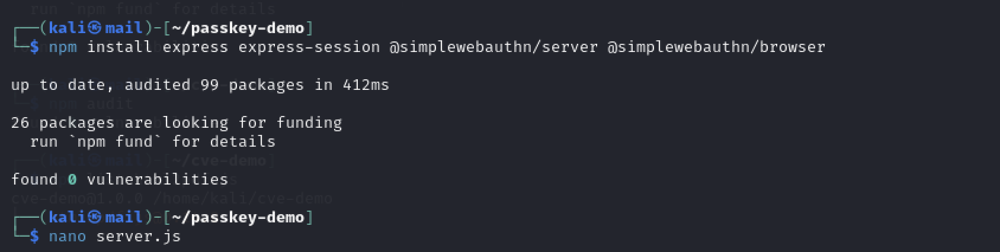
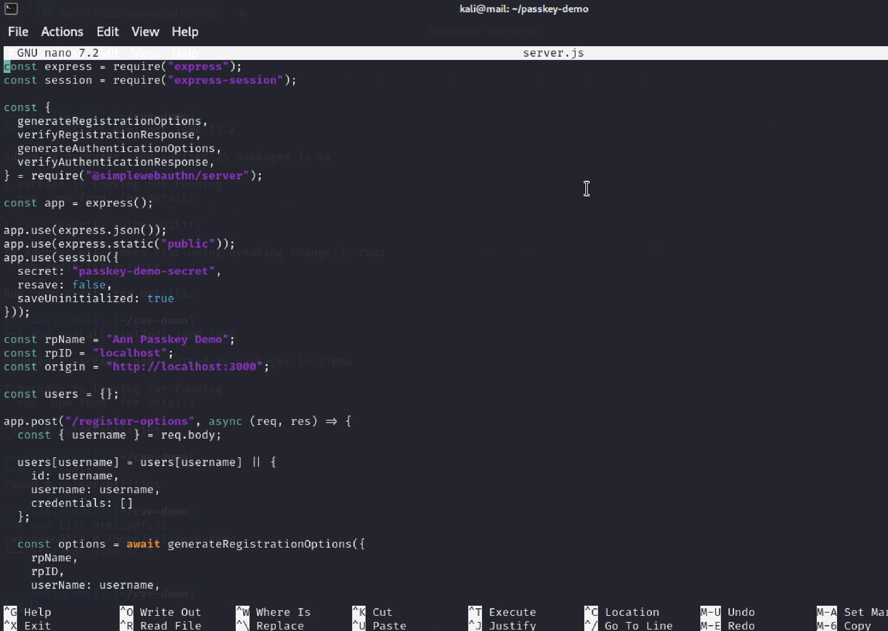
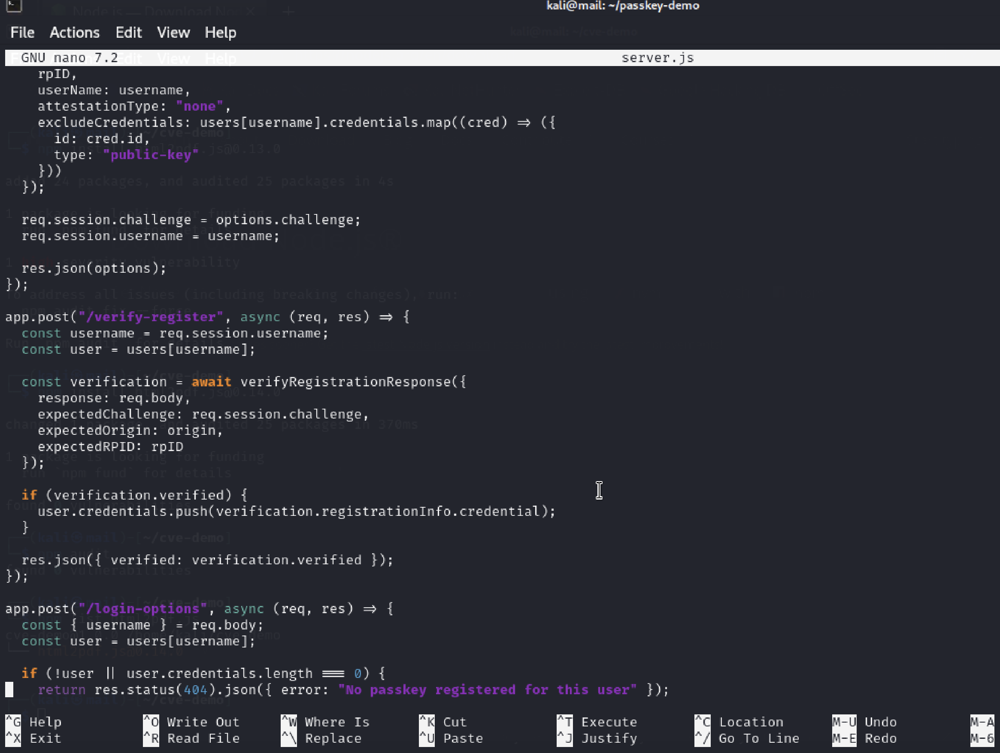
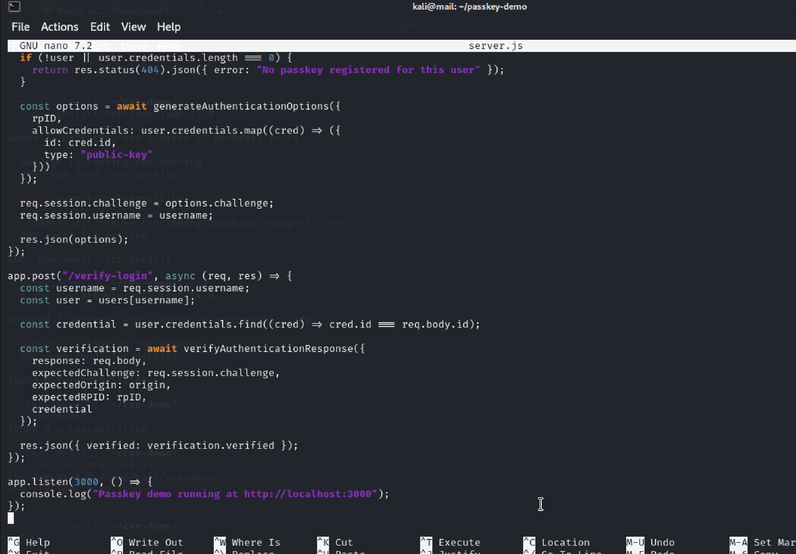
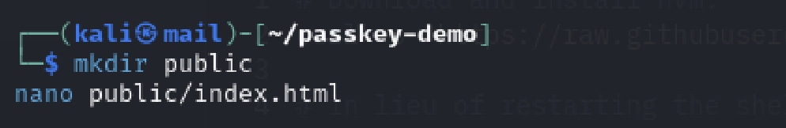
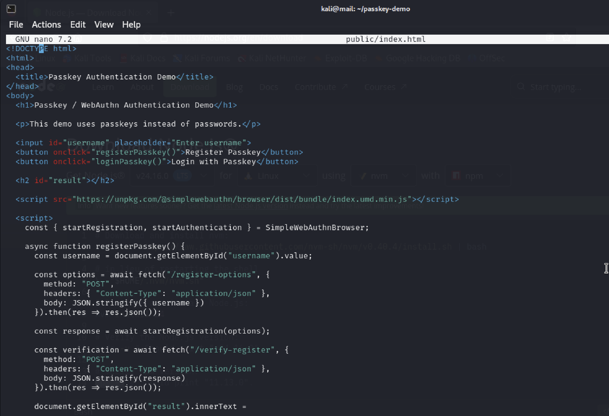
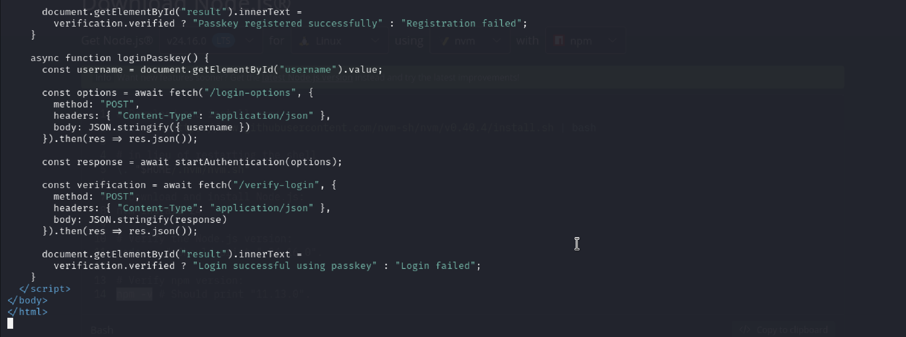
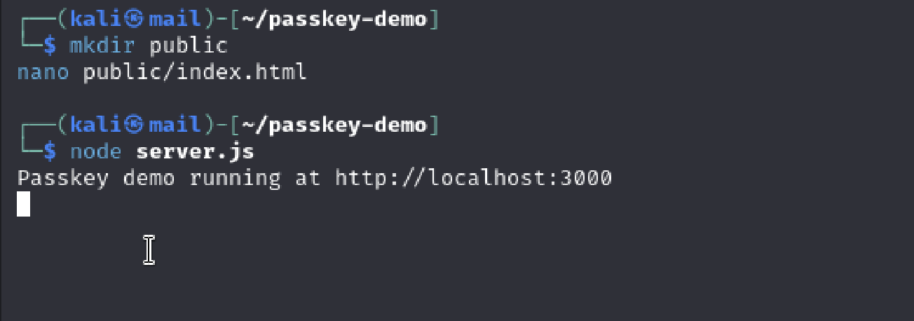
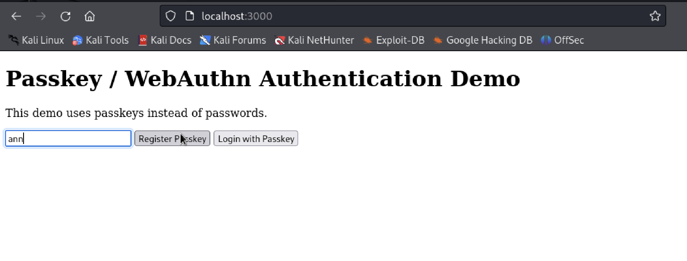
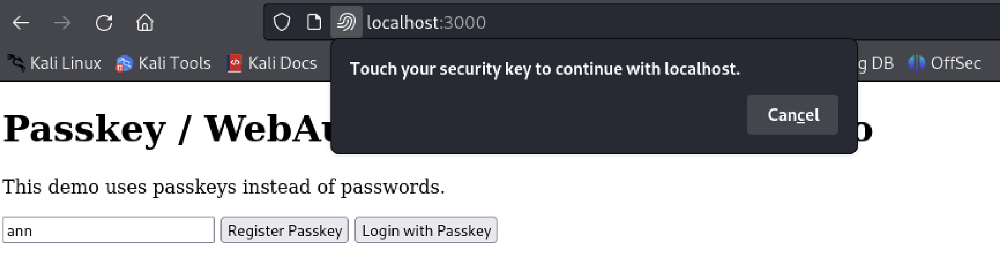

# B17 - Implement one of the current state-of-the-art solutions and evaluate it

## Description
For this activity, I implemented a modern phishing-resistant authentication system using WebAuthn/passkeys instead of traditional passwords. A local demo website was created and hosted on `localhost:3000` using Node.js, Express.js and the SimpleWebAuthn library. The implementation allowed users to register and authenticate using a passkey/security key rather than a password.

---

# Implementation Steps

## Step 1 - Create Project Directory
A new project directory was created for the passkey authentication demo.

```bash
mkdir passkey-demo
cd passkey-demo
```

---

## Step 2 - Install Required Dependencies
The required WebAuthn and Express.js libraries were installed using npm.

```bash
npm install express express-session @simplewebauthn/server @simplewebauthn/browser
```

This installed:
- Express.js web server
- Session handling
- SimpleWebAuthn server library
- SimpleWebAuthn browser library

Evidence:



---

## Step 3 - Create the Backend Authentication Server
A backend authentication server (`server.js`) was created using Node.js and Express.

The server:
- handled WebAuthn registration requests
- generated authentication challenges
- verified passkey registration
- verified login authentication responses
- stored registered credentials temporarily

The following WebAuthn functionality was implemented:
- `generateRegistrationOptions()`
- `verifyRegistrationResponse()`
- `generateAuthenticationOptions()`
- `verifyAuthenticationResponse()`

Evidence:







---

## Step 4 - Create the Frontend Website
A `public` directory and `index.html` file were created for the frontend interface.

```bash
mkdir public
nano public/index.html
```

The frontend contained:
- username input field
- register passkey button
- login with passkey button
- JavaScript WebAuthn browser functions

Evidence:







---

## Step 5 - Start the WebAuthn Server
The Node.js authentication server was started locally.

```bash
node server.js
```

The server successfully started on:
`http://localhost:3000`

Evidence:



---

## Step 6 - Access the Demo Website
The passkey authentication website was opened in the browser using localhost.

The website allowed:
- passkey registration
- passkey authentication/login

Evidence:



---

## Step 7 - Register and Test Passkey Authentication
A username was entered and the “Register Passkey” button was clicked.

The browser then displayed a WebAuthn security prompt requesting security key/device authentication. This confirmed that cryptographic passkey authentication was being used instead of traditional password-based authentication.

Evidence:



---

# Evaluation and Analysis

This implementation demonstrated how modern WebAuthn/passkey authentication systems work in practice. Unlike traditional passwords, passkeys use public-key cryptography and securely store credentials on the user’s trusted device.

## Security Benefits Observed
- Reduces phishing risks
- Eliminates password reuse problems
- Prevents credential stuffing attacks
- Uses cryptographic authentication instead of shared passwords
- Requires device-based authentication

## What I Learned
Through this activity, I learned how passkeys function as a state-of-the-art authentication solution designed to improve account security and user safety. I also learned how WebAuthn integrates browser security, device authentication and cryptographic verification to create phishing-resistant login systems.

Overall, this task improved my understanding of modern authentication technologies and how advanced identity security systems are implemented in real-world environments.

