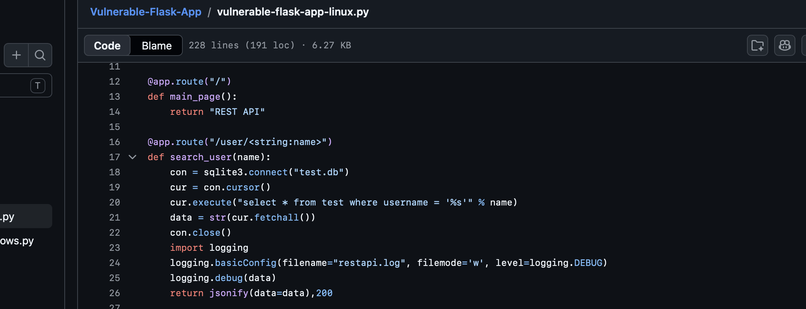
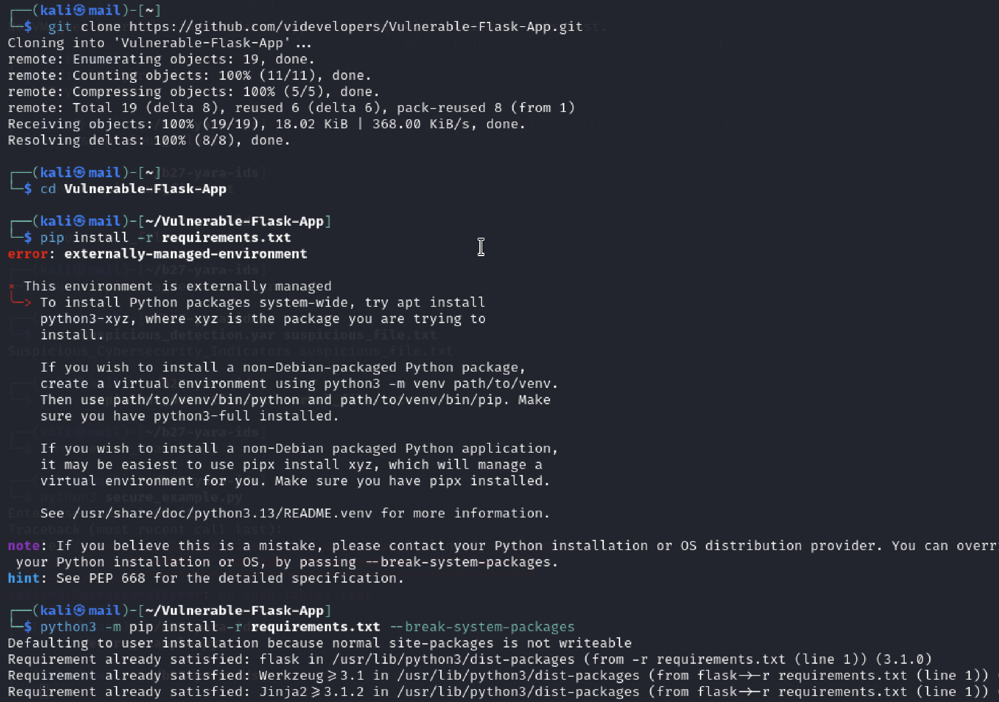
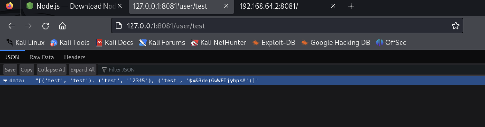
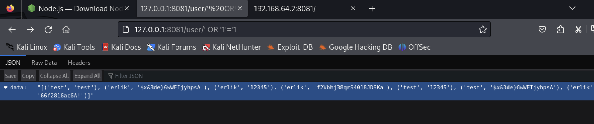

# Find and Fix a Vulnerability from a GitHub Project

# Vulnerability Identified: SQL Injection (CWE-89)

---

# Project Details

| Item | Details |
|---|---|
| Project Name | Vulnerable-Flask-App |
| GitHub Repository | videvelopers/Vulnerable-Flask-App |
| Repository URL | https://github.com/videvelopers/Vulnerable-Flask-App |
| Programming Language | Python |
| Framework | Flask |
| Database | SQLite3 |
| Vulnerability Type | SQL Injection |
| CWE Classification | CWE-89 |
| OWASP Category | A03:2021 – Injection |
| Severity | High |

---

# Step 1 - Analyse the Vulnerable Source Code

The vulnerable Flask application source code was analysed to identify insecure database query handling.

The vulnerable endpoint was found in:

`/user/<name>`

The application directly inserted user input into the SQL query using Python string formatting.

## Vulnerable Code

```python
cur.execute("select * from test where username = '%s'" % name)
```

Evidence:



---

# Why It Is Vulnerable

The application directly inserted attacker-controlled input into the SQL query using `%` string formatting.

This allowed user input to become part of the SQL command itself rather than being treated as plain data.

As a result, attackers could manipulate the query logic and inject arbitrary SQL statements.

---

# Step 2 - Clone the GitHub Repository

The vulnerable project repository was cloned from GitHub into the Kali Linux environment.

## Command Used

```bash
git clone https://github.com/videvelopers/Vulnerable-Flask-App.git
cd Vulnerable-Flask-App
```

Evidence:



---

# Step 3 - Install Project Dependencies

The Flask project dependencies were installed using pip.

Initially, Kali Linux produced an externally-managed-environment warning, so the packages were installed using the `--break-system-packages` option.

## Commands Used

```bash
pip install -r requirements.txt
```

## Corrected Command

```bash
python3 -m pip install -r requirements.txt --break-system-packages
```

Evidence:


---

# Step 4 - Run and Test the Vulnerable Application

The vulnerable Flask application was started locally and tested through the browser.

A normal request was first performed to observe standard application behaviour.

## Normal Request

```text
http://127.0.0.1:8081/user/test
```

The application returned only records related to the username “test”.

Evidence:



---

# Step 5 - Perform SQL Injection Attack

The application was tested using a classic SQL Injection payload.

## Payload Used

```sql
' OR '1'='1
```

The malicious payload was inserted into the vulnerable endpoint URL.

## Exploit Request

```text
http://127.0.0.1:8081/user/' OR '1'='1
```

Evidence:



---

# Resulting SQL Query

The vulnerable application generated the following SQL query internally:

```sql
SELECT * FROM test WHERE username = '' OR '1'='1'
```

Because:

```sql
'1'='1'
```

always evaluates to TRUE, the WHERE clause was bypassed and all database records were returned.

---

# Security Impact

This vulnerability could potentially allow:

- unauthorised data disclosure
- authentication bypass
- database manipulation
- deletion of records
- extraction of sensitive information
- complete database compromise

SQL Injection vulnerabilities are considered highly dangerous because attackers can directly interact with backend databases through manipulated input.

---

# Step 6 - Implement a Secure Remediation

To demonstrate secure remediation, a new secure example file was created.

## Command Used

```bash
nano secure_example.py
```

Evidence:

.png)

---

# Step 7 - Replace Vulnerable Query with Parameterized Query

The insecure SQL query was replaced with a secure parameterized query using SQLite placeholders.

## Secure Version

```python
cur.execute("select * from test where username = ?", (name,))
```

Instead of directly inserting user input into the SQL statement, the query safely separated SQL logic from user-controlled data.

Evidence:

.png)

---

# Why This Fix Works

Parameterized queries prevent SQL Injection by treating user input strictly as data rather than executable SQL code.

Even if an attacker enters malicious payloads such as:

```sql
' OR '1'='1
```

the database driver safely escapes and handles the input without altering the SQL query structure.

This prevents attackers from injecting arbitrary SQL commands.

---

# Step 8 - Test the Secure Implementation

The secure example was tested using the same SQL Injection payload.

## Command Used

```bash
python3 secure_example.py
```

Payload entered:

```sql
' OR '1'='1
```

The secure implementation returned no database records, demonstrating that the SQL Injection attack was successfully mitigated.

Evidence:

.png)

---

# What I Learned

Through this activity, I learned how SQL Injection vulnerabilities occur when applications directly insert user input into SQL statements without proper sanitisation or parameterisation.

I also learned why SQL Injection is considered one of the most dangerous web application vulnerabilities and how secure coding practices such as parameterized queries are used to mitigate injection attacks in real-world applications.

This task improved my understanding of:
- web application security
- backend database interaction
- secure coding practices
- SQL Injection exploitation techniques
- practical vulnerability remediation
