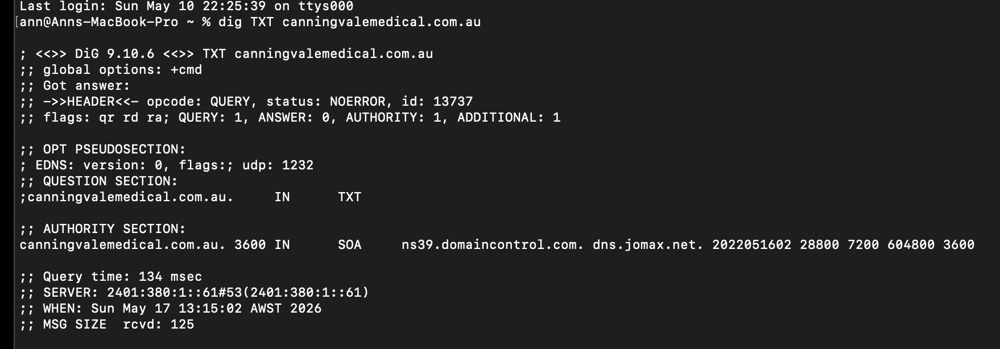
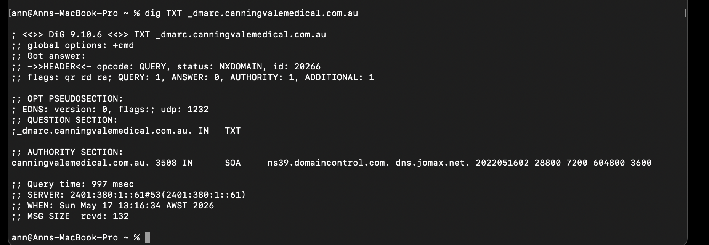
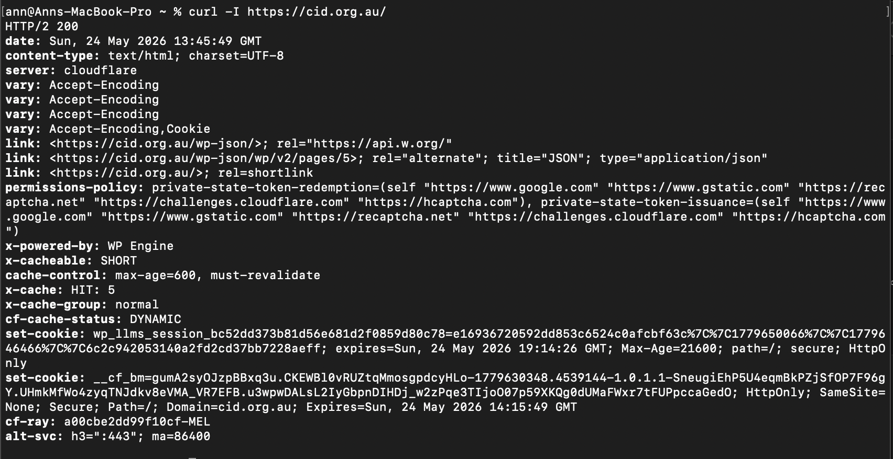
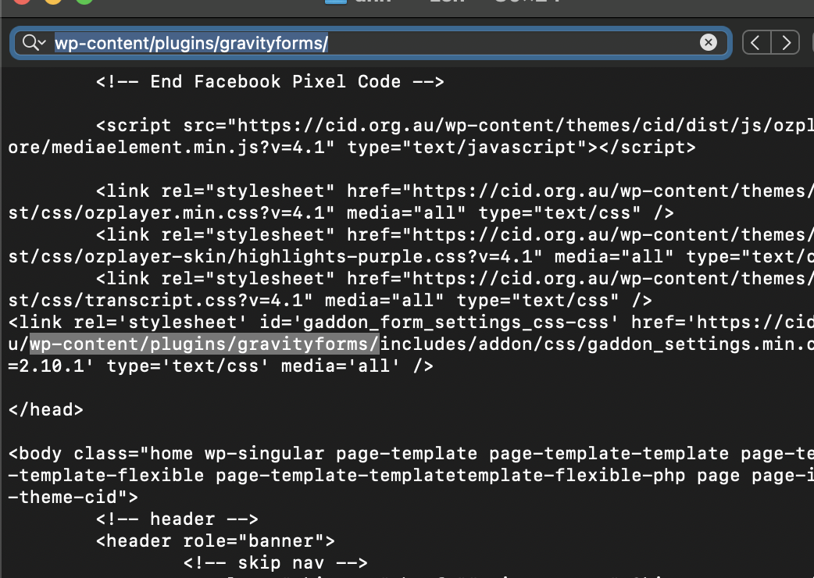

# B1 - Discover 5 Unique Weak/Vulnerable security implementations
## Weak Security Implementations Identified –
### 1) Missing SPF Records and DMARC Email Authentication Records
Weak Security Implementation found -
On passive analysis of https://www.canningvalemedical.com.au it was found that the domain did not have an SPF(Sender Policy Framework) record nor did it have  DMARC policy configured.
Command used – dig TXT canningvalemedical.com.au

dig TXT _dmarc.canningvalemedical.com.au

Security Risk -
Without SPF, attackers can spoof emails pretending to originate from the domain because receiving mail servers cannot verify authorised sending servers. Without DMARC enforcement, spoofed emails may bypass security filtering and successfully reach users which can lead to phishing attacks, credential theft, malware delivery etc.

### 2) Technology and Infrastructure Information Disclosure Through HTTP Headers
Weak Security Implementation found –
The website https://cid.org.au/ was observed exposing backend technology and hosting infrastructure information through HTTP response headers. HTTP header inspection revealed – 
x-powered-by: WP Engine

Command used - curl -I https://cid.org.au/ 
Security Risk – Technology disclosure assists attackers during the reconnaissance phase of cyberattacks by revealing information about the website’s infrastructure, hosting provider, content management system, and backend technologies. Attackers may use this information to identify known vulnerabilities, platform-specific exploits, or misconfigurations associated with the disclosed technologies.

### 3) Missing Content Security Policy (CSP)
Weak Security Implementation found –
The website https://cid.org.au/ was observed not implementing a Content Security Policy (CSP) header within its HTTP response headers.

Command used –
curl -I https://cid.org.au/
Evidence –
No Content-Security-Policy header was present in the HTTP response headers.
Security Risk –
Without CSP, browsers have fewer restrictions on which scripts, resources, and external content can execute on the website. This increases the risk of cross-site scripting (XSS), malicious script injection, and content injection attacks.

### 4) Missing X-Frame-Options Header
Weak Security Implementation found –
During HTTPS inspection, the website https://cid.org.au/ was observed not implementing the X-Frame-Options HTTP security header.
Command used –  curl -I https://cid.org.au/
Evidence –
No X-Frame-Options header was present in the HTTP response headers.
Security Risks –
Without clickjacking protection headers such as X-Frame-Options, attackers may embed the website inside malicious invisible frames and trick users into interacting with the website unknowingly. This may lead to clickjacking attacks and unauthorised user actions.

### 5) Plugin Enumeration/version disclosure
Weak Security Implementation found –
The website https://cid.org.au/ was observed exposing internal WordPress plugin directories and plugin version information through publicly accessible source code and loaded resources.

Evidence observed – 
/wp-content/plugins/gravityforms/
gaddon_settings.min.css?ver=2.10.1

Command used - curl https://cid.org.au/ 

Security Risks – 

Exposed plugin names and versions increase reconnaissance opportunities for attackers as threat actors may use this information to identify publicly known vulnerabilities (CVEs) affecting specific plugin versions and automate targeted attacks against the website. Public disclosure of internal application structure also increases attack surface visibility.

