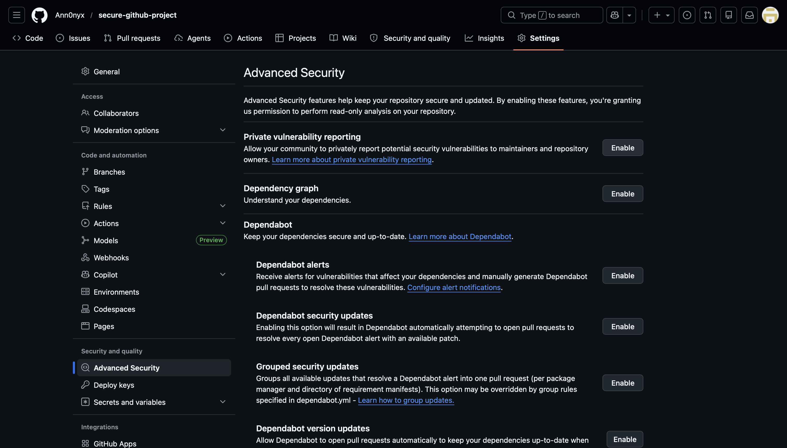
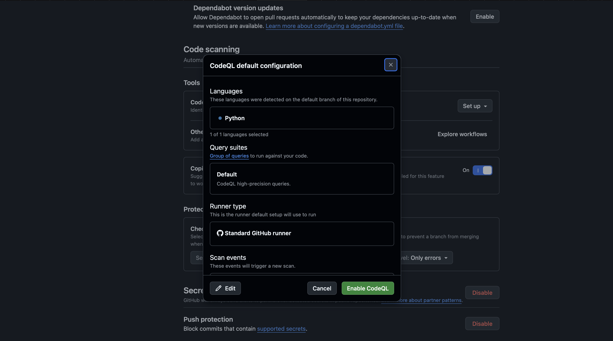
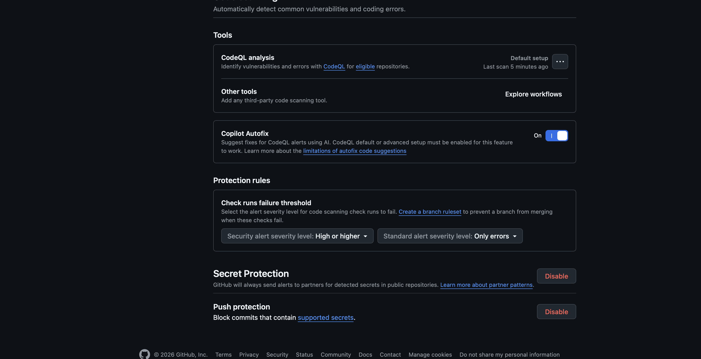
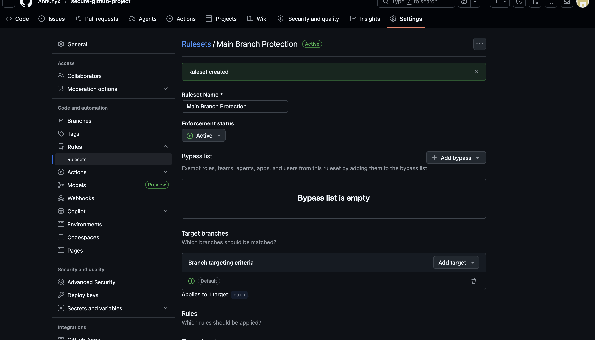
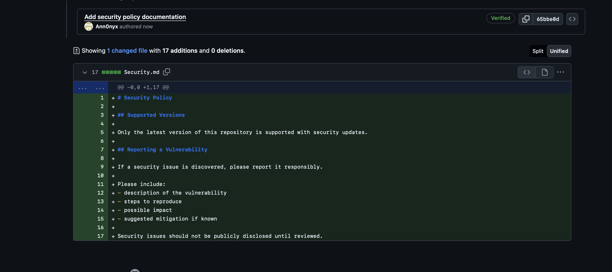
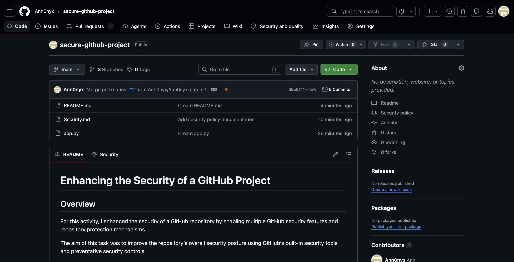

# B20 - Enhance the Security of a GitHub Project

# Activity Overview

For this activity, I enhanced the security of a GitHub repository by enabling multiple GitHub security and repository protection features within a test repository named:

```text
secure-github-project
```

The purpose of this task was to improve repository security using GitHub’s built-in security and DevSecOps protection mechanisms.

---

# Repository Information

| Item | Details |
|---|---|
| Repository Name | secure-github-project |
| Platform | GitHub |
| Repository Type | Public Repository |
| Security Features Enabled | Dependabot, CodeQL, Secret Protection, Push Protection, Branch Protection |
| Additional Security Feature | SECURITY.md Vulnerability Disclosure Policy |

---

# Step 1 - Open Repository Security Settings

The repository settings page was opened and the GitHub “Advanced Security” section was accessed.

Path used:

```text
Repository → Settings → Advanced Security
```

Evidence:



---

# Step 2 - Enable Dependency Graph

The Dependency Graph feature was enabled.

This allows GitHub to identify project dependencies and monitor packages used within the repository.

## Security Benefit

- improves dependency visibility
- helps identify vulnerable packages
- supports Dependabot security monitoring

---

# Step 3 - Enable Dependabot Alerts

Dependabot Alerts were enabled.

This feature automatically scans dependencies for publicly known vulnerabilities.

## Security Benefit

- detects insecure dependencies
- warns maintainers about vulnerable packages
- helps reduce software supply chain risks

Evidence:


---

# Step 4 - Enable Dependabot Security Updates

Dependabot Security Updates were enabled.

This feature automatically creates pull requests when vulnerable dependencies have security patches available.

## Security Benefit

- automates dependency patching
- improves update management
- reduces exposure to vulnerable libraries

Evidence:


---

# Step 5 - Enable CodeQL Code Scanning

GitHub CodeQL analysis was configured and enabled.

The repository detected Python as the project language and the default CodeQL security query suite was selected.

## Configuration Used

- Language: Python
- Query Suite: Default
- Runner Type: Standard GitHub Runner

Evidence:



---

# Step 6 - Run CodeQL Security Analysis

CodeQL scanning was successfully enabled and configured.

GitHub automatically began scanning the repository for:
- insecure coding practices
- common vulnerabilities
- unsafe patterns
- code quality issues

## Security Benefit

- automated static application security testing (SAST)
- vulnerability detection
- secure code analysis

Evidence:



---

# Step 7 - Enable Secret Protection

GitHub Secret Protection was enabled.

This feature scans repositories for exposed secrets such as:
- API keys
- tokens
- passwords
- cloud credentials

## Security Benefit

- reduces credential leakage
- prevents accidental secret exposure
- improves repository security posture

Evidence:


---

# Step 8 - Enable Push Protection

Push Protection was enabled.

This feature blocks commits containing detected secrets before they are pushed to the repository.

## Security Benefit

- prevents accidental credential commits
- blocks insecure pushes in real time
- improves secure development practices

Evidence:


---

# Step 9 - Configure Branch Protection Rules

Branch protection rules were implemented for the main branch.

Path used:

```text
Settings → Rules → Rulesets
```

A ruleset named:

```text
Main Branch Protection
```

was created and applied to the `main` branch.

The ruleset was configured as:

```text
Enforcement Status: Active
```

Evidence:



---

# Branch Protection Security Controls

The implemented branch protection controls included:

- requiring pull requests before merging
- blocking force pushes
- preventing unsafe direct modifications
- protecting the integrity of the main branch

## Security Benefit

- improves repository integrity
- reduces accidental code modification
- supports safer collaboration workflows
- strengthens change management practices

---

# Step 10 - Create SECURITY.md Policy

A SECURITY.md vulnerability disclosure policy document was added to the repository.

The file included:
- vulnerability reporting instructions
- responsible disclosure guidance
- mitigation reporting guidance
- security contact expectations

Evidence:



---

# Step 11 - Verify Security Features in Repository

The repository homepage successfully displayed the configured security features and policy documentation.

GitHub displayed:
- Security Policy
- repository protection features
- enhanced repository security configuration

Evidence:



---

# Security Features Implemented

The implemented security controls included:

- Dependabot alerts
- Dependabot security updates
- CodeQL code scanning
- Secret protection
- Push protection
- Branch protection rules
- SECURITY.md vulnerability disclosure policy

---

# Security Impact

These security controls improve repository security by:

- detecting vulnerable dependencies
- identifying insecure code patterns
- preventing exposed credentials
- improving repository integrity
- enforcing safer development workflows
- strengthening secure collaboration practices

The implementation also demonstrated practical use of:
- DevSecOps principles
- automated security tooling
- preventative security controls
- software supply chain security

---

# What I Learned

Through this activity, I learned how GitHub provides built-in security mechanisms that help secure software projects throughout the development lifecycle.

I also learned how:
- automated dependency scanning works
- CodeQL performs static code analysis
- secret detection protects credentials
- branch protection improves repository integrity
- security policies support responsible vulnerability disclosure

This task improved my understanding of modern software security practices and practical DevSecOps security implementation within GitHub repositories.
