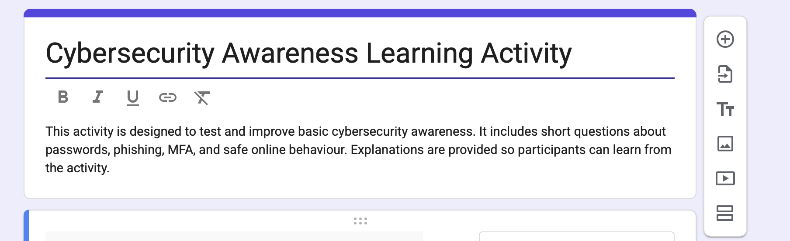
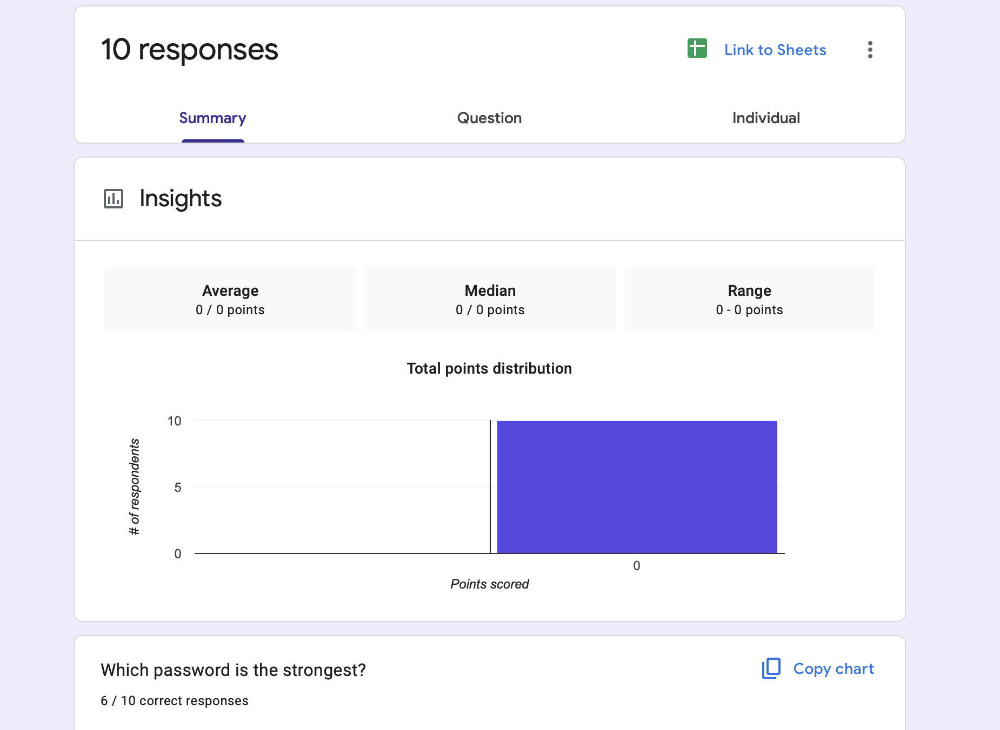
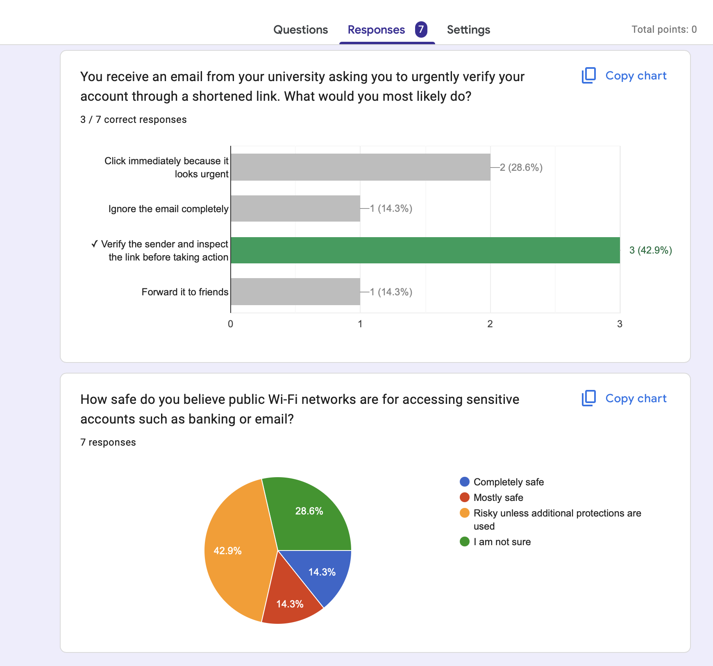
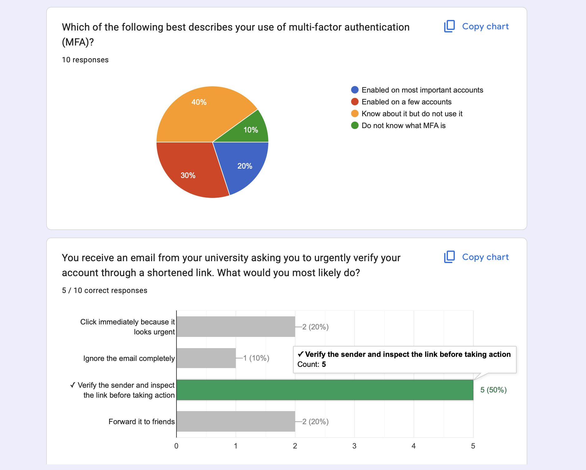
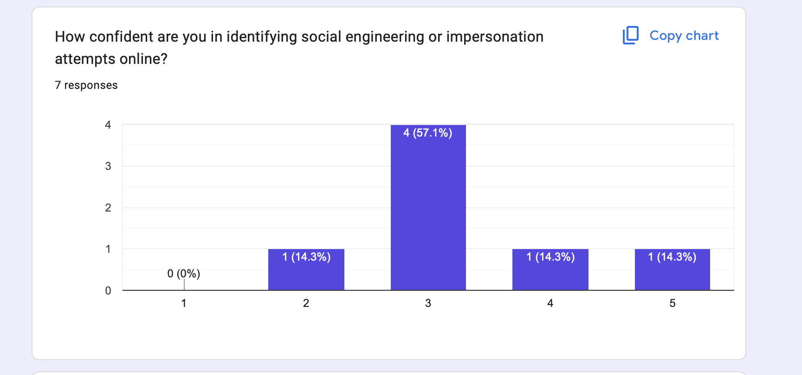
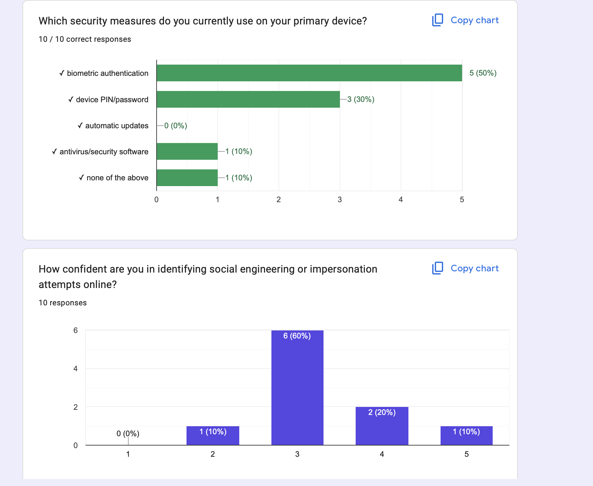
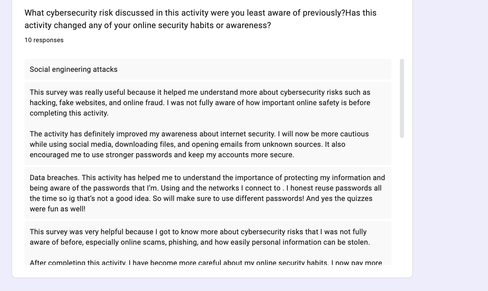

# Design and Implement a Cybersecurity Learning Activity

# Overview

For this activity, I designed and implemented a cybersecurity awareness learning activity using Google Forms. The activity was created to educate students about common cybersecurity risks and evaluate their understanding of safe online behaviour.

The learning activity included:
- multiple-choice questions
- scenario-based cybersecurity situations
- reflection questions

The questions focused on cybersecurity topics such as:
- password security
- phishing attacks
- public Wi-Fi safety
- data breaches
- multi-factor authentication (MFA)

A total of 10 participants completed the activity, and their responses were automatically analysed using Google Forms analytics.

---

# Activity Design

The activity was designed to be interactive and educational rather than only theoretical. Participants were presented with realistic cybersecurity scenarios to test how they would respond in practical situations.

Informative explanations and descriptions were also provided alongside questions to improve participant understanding and awareness throughout the activity.

The cybersecurity topics covered included:

- strong password practices
- password reuse risks
- phishing and suspicious links
- public Wi-Fi security
- multi-factor authentication (MFA)
- data breach response
- social engineering awareness

The activity also included reflection questions asking participants whether the activity changed their cybersecurity awareness or online habits.

---

# Implementation

The cybersecurity learning activity was implemented using Google Forms and distributed online to participants.

The form included:
- knowledge-based cybersecurity questions
- behaviour-based cybersecurity scenarios
- practical decision-making situations
- awareness and reflection questions

Google Forms response analytics and charts were used to analyse participant understanding, awareness levels and cybersecurity behaviour patterns.

---

# Results and Findings

The results demonstrated several common cybersecurity weaknesses among participants.

## Password Reuse

Many participants reported reusing passwords across multiple websites and services.

This highlighted:
- weak password management practices
- increased risk of credential stuffing attacks
- poor account security habits

---

## Phishing Awareness

The phishing awareness questions produced mixed results.

Only 5 out of 10 participants correctly selected the safest response when presented with a suspicious university verification email scenario.

This demonstrated that:
- phishing attacks remain highly effective
- impersonation attacks can still deceive users
- users may struggle to identify suspicious emails

---

## Multi-Factor Authentication (MFA)

The activity also showed inconsistent adoption of multi-factor authentication.

Some participants regularly used MFA on important accounts, while others:
- did not enable MFA
- rarely used MFA
- were unfamiliar with the concept entirely

This highlighted gaps in cybersecurity awareness regarding account protection mechanisms.

---

## Public Wi-Fi and Data Breach Awareness

Questions relating to public Wi-Fi security and data breach response showed that some participants:
- underestimated cybersecurity risks
- were unsure how to respond safely after a breach
- did not fully understand safe browsing practices

This demonstrated the importance of continued cybersecurity education and awareness training.

---

# Effectiveness of the Activity

The activity was effective because it combined practical cybersecurity scenarios with educational content.

Instead of only presenting theoretical information, participants actively engaged with realistic online security situations and decision-making exercises.

The activity successfully:
- identified weaknesses in cybersecurity awareness
- encouraged safer online behaviour
- improved participant understanding of cybersecurity risks
- promoted critical thinking regarding online safety

The reflection responses also demonstrated that the activity positively influenced participant awareness and understanding of cybersecurity practices.

---

# Skills and Knowledge Gained

Through this activity, I improved my understanding of:
- cybersecurity awareness education
- designing interactive learning activities
- analysing cybersecurity behaviour patterns
- phishing and social engineering awareness
- user security decision-making
- survey and response analysis

I also improved my ability to communicate cybersecurity concepts in a practical and understandable way for non-technical participants.

---

# Conclusion

This activity demonstrated how cybersecurity awareness activities can be used to identify risky online behaviours and educate users about safe cybersecurity practices.

The results highlighted that many users still lack awareness regarding phishing attacks, password security, MFA usage and public Wi-Fi risks.

Overall, the activity successfully combined education, interaction and practical cybersecurity awareness while improving participant understanding of online safety and security practices.

## Survey Evidence

### Survey Introduction

### Responses Overview

