# Test an Intrusion Detection System and Discuss its Effectiveness

# Overview

For this activity, I installed, configured and tested the Snort 3 Intrusion Detection System (IDS) on a Kali Linux virtual machine. The aim of the task was to monitor network traffic and detect suspicious activity using custom intrusion detection rules.

A custom ICMP detection rule was created to detect ping traffic across the network. Snort was then configured to monitor the network interface and generate real-time alerts whenever ICMP packets were detected.

The activity demonstrated how IDS technologies can be used to monitor network traffic, identify suspicious behaviour and generate security alerts for further investigation.

---

# Objective

The objective of this activity was to:

- install and configure Snort 3
- create a custom IDS detection rule
- monitor live network traffic
- generate intrusion detection alerts
- evaluate the effectiveness of an IDS

---

# Environment and Tools Used

| Tool / System | Purpose |
|---|---|
| Kali Linux VM | Testing environment |
| Snort 3 | Intrusion Detection System |
| Nano | Editing Snort configuration files |
| ICMP Ping | Generating test traffic |
| Virtual Network Interface (eth0) | Network monitoring |

---

# Installation and Configuration

## Step 1 — Updating the System and Installing Snort

The Kali Linux system package list was updated and Snort 3 was installed using APT.

Command used:

```bash
sudo apt update
sudo apt install snort -y
```

This installed:
- Snort 3
- default Snort rules
- required libraries
- logging components

The installation completed successfully without errors.

### Evidence

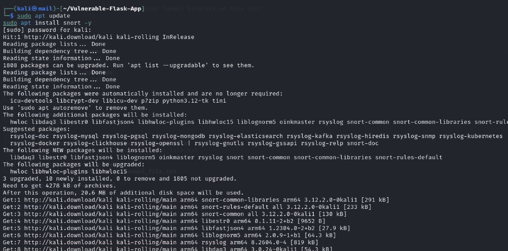

---

## Step 2 — Verifying the Snort Installation

After installation, the Snort version and configuration were verified.

Command used:

```bash
snort -V
```

The output confirmed:
- Snort++ version 3.12.2.0
- successful configuration validation
- no warnings present

This verified that the IDS software was correctly installed and operational.

### Evidence

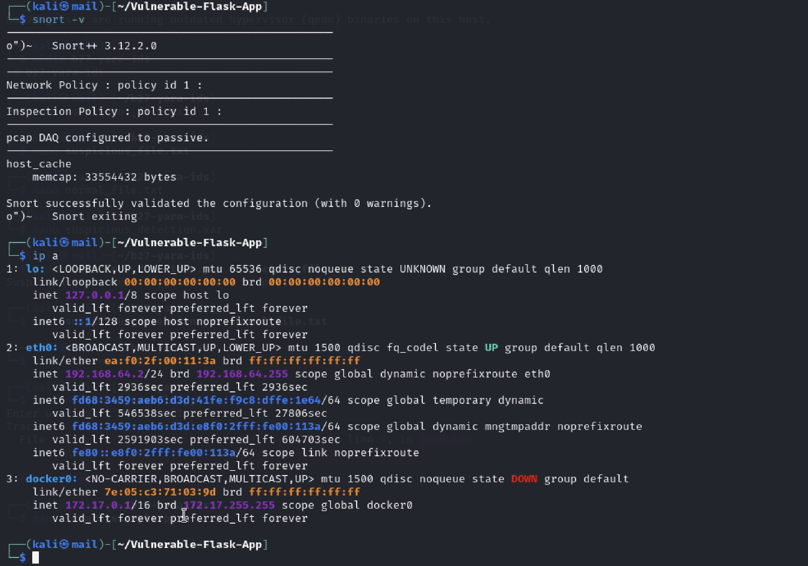

---

## Step 3 — Identifying the Network Interface

The active network interface was identified using:

```bash
ip a
```

The output showed:
- interface: eth0
- local IP address: 192.168.64.2

This interface was later used by Snort for packet monitoring.

### Evidence

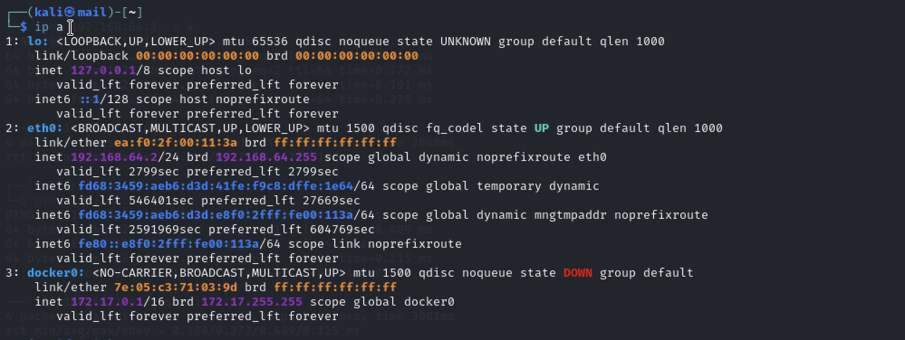

---

# Creating a Custom IDS Rule

## Step 4 — Editing the Local Rules File

The local Snort rules file was opened using Nano:

```bash
sudo nano /etc/snort/rules/local.rules
```

A custom ICMP detection rule was added:

```bash
alert icmp any any -> any any (msg:"ICMP ping detected"; sid:1000001; rev:1;)
```

### Rule Explanation

| Component | Description |
|---|---|
| alert | Generate an alert |
| icmp | Detect ICMP traffic |
| any any | Any source IP and port |
| -> | Direction of traffic |
| any any | Any destination IP and port |
| msg | Alert message |
| sid | Unique Snort rule ID |
| rev | Rule revision number |

This rule instructed Snort to generate an alert whenever ICMP ping traffic was detected.

### Evidence

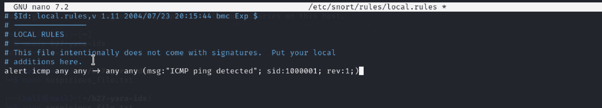

---

# Configuring Snort

## Step 5 — Loading the Local Rules

The Snort configuration file was edited:

```bash
sudo nano /etc/snort/snort.lua
```

The following line was added:

```bash
include $RULE_PATH/local.rules
```

This ensured the custom detection rules were loaded during execution.

Initially, Snort did not generate alerts because the rules were not correctly loaded into the configuration. After adding the include statement, the IDS functioned correctly.

This demonstrated the importance of proper IDS configuration and rule loading.

### Evidence


---

# Running the IDS

## Step 6 — Launching Snort in IDS Mode

Snort was launched in IDS monitoring mode using:

```bash
sudo snort -c /etc/snort/snort.lua -R /etc/snort/rules/local.rules -A cmg -i eth0
```

### Command Explanation

| Parameter | Purpose |
|---|---|
| -c | Load Snort configuration file |
| -R | Load custom rules file |
| -A cmg | Display detailed console alerts |
| -i eth0 | Monitor the eth0 interface |

Snort successfully loaded:
- 220 rules
- protocol inspectors
- detection engines
- packet processing modules

The IDS then began monitoring live traffic on the network interface.

### Evidence

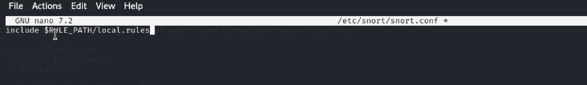

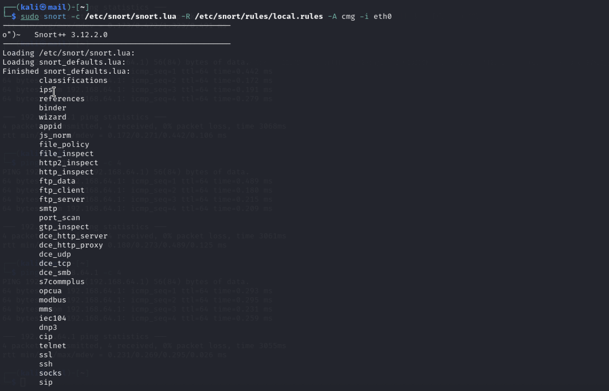

---

# Generating Test Traffic

## Step 7 — Generating ICMP Traffic

To test the IDS, ICMP ping traffic was generated using:

```bash
ping 192.168.64.1 -c 4
```

The system successfully transmitted and received:
- 4 ICMP echo requests
- 4 ICMP echo replies

This traffic was used to trigger the custom Snort detection rule.

### Evidence

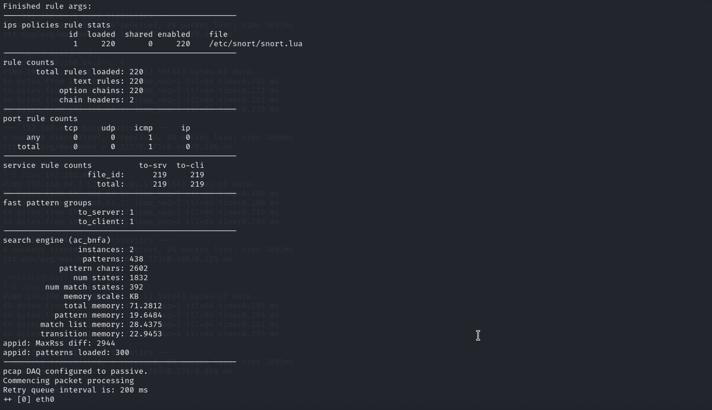

---

# Detection Results

## Step 8 — IDS Alert Generation

Snort successfully generated multiple real-time alerts after detecting the ICMP packets.

The alerts included:
- source IP address
- destination IP address
- ICMP packet type
- sequence numbers
- packet details
- hexadecimal packet contents

Example alert information included:
- ICMP echo requests
- ICMP echo replies
- IPv4 ICMP traffic
- IPv6 ICMP traffic

The alerts confirmed that:
- the IDS was actively monitoring traffic
- the custom rule was functioning correctly
- Snort successfully detected matching network activity

### Evidence

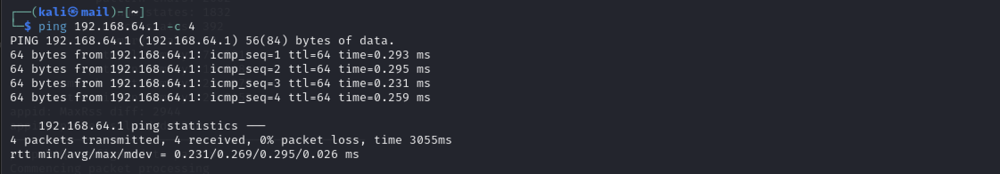

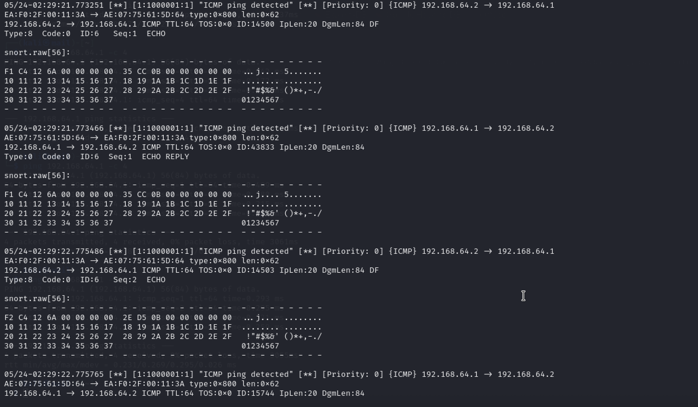

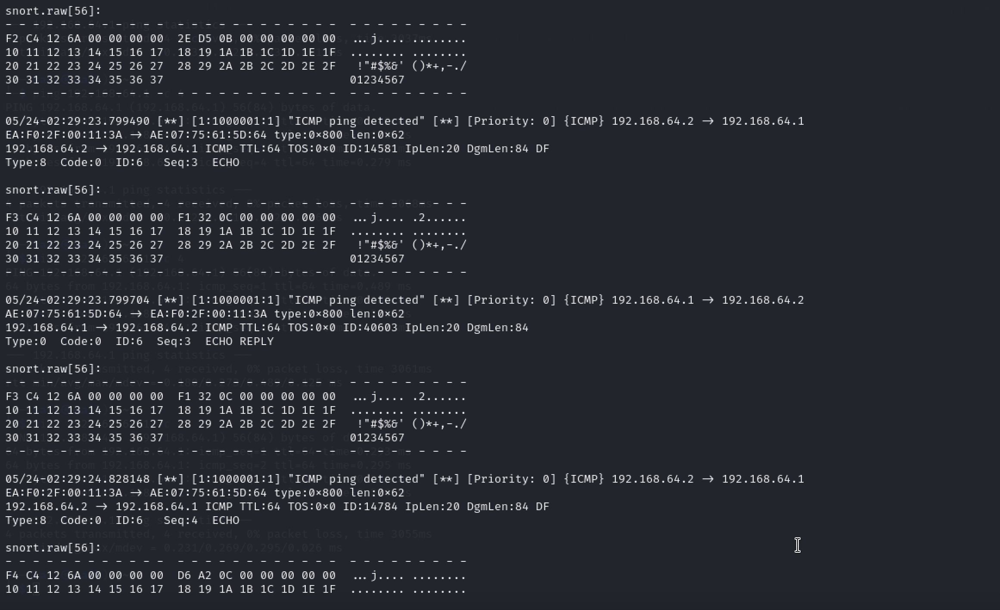

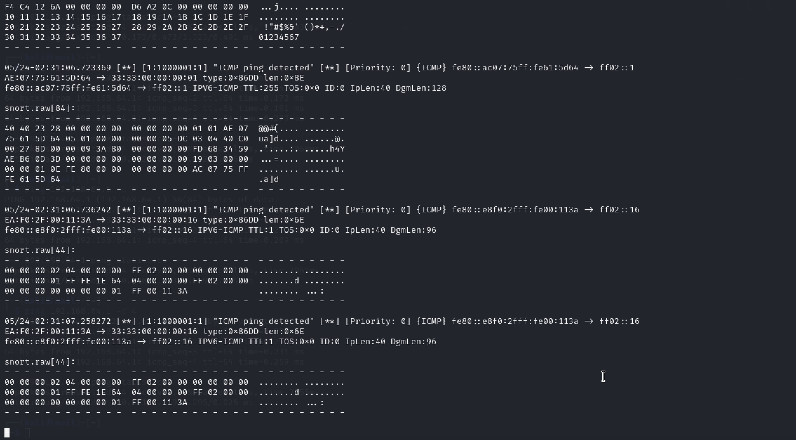

---

# Effectiveness of the IDS

The intrusion detection system was effective because it successfully detected ICMP ping traffic generated during testing.

Snort produced real-time alerts whenever packets matched the custom detection rule. The alerts included useful information such as:
- source IP address
- destination IP address
- packet type
- ICMP sequence information
- packet contents

This demonstrated that the IDS was actively monitoring network traffic and correctly identifying configured activity.

However, the testing also showed that IDS effectiveness depends heavily on:
- correct configuration
- rule quality
- rule tuning
- updated signatures

Initially, Snort did not generate alerts because the rules were not properly loaded into the Snort 3 configuration. This highlighted the importance of proper setup and configuration management.

The experiment also demonstrated several limitations of signature-based IDS systems:

- Snort only detected traffic matching configured rules
- unknown or modified attacks may bypass detection
- poorly written rules may create false positives
- excessive alerts may overwhelm analysts

Despite these limitations, the IDS successfully demonstrated effective monitoring and alerting capabilities.

---

# Skills and Knowledge Gained

Through this activity, I improved my understanding of:

- intrusion detection systems (IDS)
- Snort 3 configuration
- custom rule creation
- network packet monitoring
- ICMP traffic analysis
- security alert analysis
- network security monitoring
- IDS troubleshooting and tuning

I also gained practical experience configuring and testing a real-world security monitoring tool within a Linux environment.

---

# Conclusion

This activity demonstrated the practical implementation and testing of a network intrusion detection system using Snort 3.

The IDS successfully detected ICMP traffic using a custom detection rule and generated detailed real-time alerts during testing.

The experiment highlighted both the strengths and limitations of intrusion detection systems. While Snort effectively detected known traffic patterns, the testing also showed that IDS accuracy depends heavily on proper configuration, updated rules and continuous monitoring.

Overall, the activity demonstrated how intrusion detection systems play an important role in network security monitoring and threat detection.
