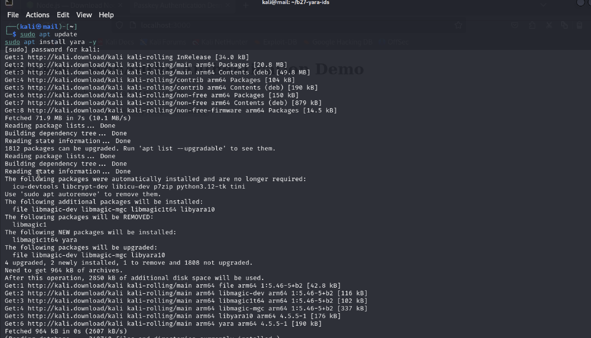
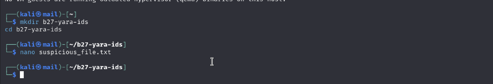
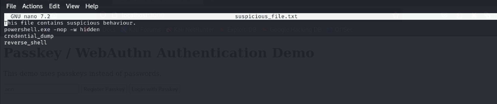
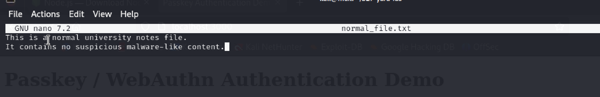
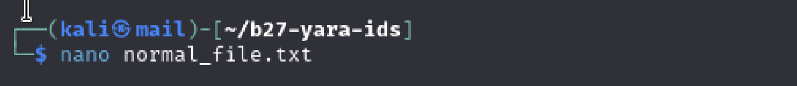
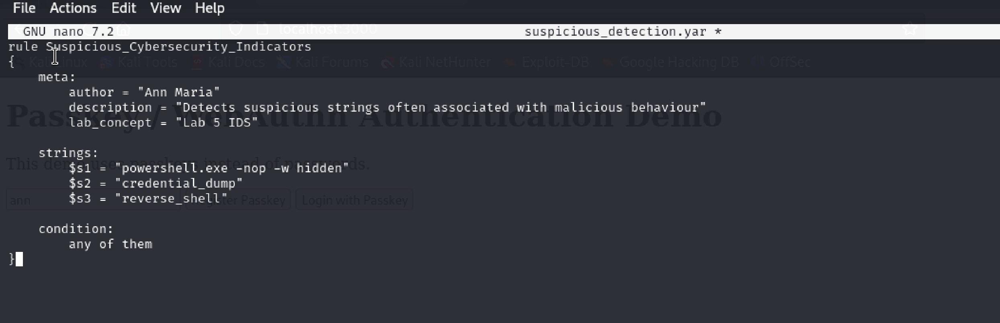
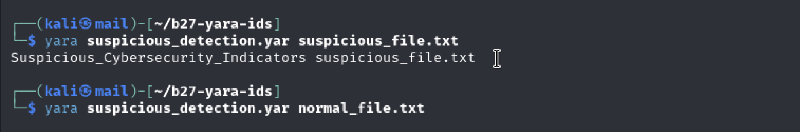

# Apply a Learned Concept in this Unit to a Real-World Application/Problem/Environment

# Overview

For this activity, I applied concepts from Intrusion Detection Systems (IDS) and signature-based detection to a real-world style file analysis environment using YARA in Kali Linux.

YARA is commonly used by cybersecurity analysts and malware researchers to identify suspicious or malicious files using predefined signatures and detection rules. In this activity, I created a custom YARA rule to detect suspicious indicators such as hidden PowerShell execution, credential dumping activity and reverse shell related strings.

The rule was then tested against both suspicious and normal files to evaluate whether the detection worked correctly. The activity demonstrated how signature-based detection methods are used in practical cybersecurity environments to automate file scanning and identify potentially malicious behaviour.

---

# Objective

The objective of this activity was to:

- install and configure YARA in Kali Linux
- create suspicious and normal test files
- develop a custom YARA detection rule
- apply signature-based detection concepts
- test the rule against multiple files
- analyse how detection systems identify suspicious content

---

# Methodology

## Step 1 — Installing YARA

YARA was installed on the Kali Linux virtual machine using the following commands:

```bash
sudo apt update
sudo apt install yara -y
```

## Evidence



The installation successfully downloaded and configured YARA on the Kali Linux system.

---

## Step 2 — Creating a Working Directory

A new directory was created to store the YARA files and testing environment.

Commands used:

```bash
mkdir b27-yara-ids
cd b27-yara-ids
```

A suspicious test file was then created:

```bash
nano suspicious_file.txt
```

## Evidence



---

## Step 3 — Creating a Suspicious Test File

The suspicious test file contained strings commonly associated with malicious behaviour such as hidden PowerShell execution, credential dumping and reverse shell activity.

Contents added to the file:

```text
This file contains suspicious behaviour.
powershell.exe -nop -w hidden
credential_dump
reverse_shell
```

## Evidence



This file simulated potentially malicious indicators that may appear in malware scripts or attacker tools.

---

## Step 4 — Creating a Normal File

A normal file was also created to test whether the detection rule would avoid false positives.

Command used:

```bash
nano normal_file.txt
```

Contents added:

```text
This is a normal university notes file.
It contains no suspicious malware-like content.
```

## Evidence





This file represented legitimate non-malicious content.

---

## Step 5 — Creating a Custom YARA Rule

A custom YARA rule file was created:

```bash
nano suspicious_detection.yar
```

## Evidence


The following rule was written:

```yara
rule Suspicious_Cybersecurity_Indicators
{
    meta:
        author = "Ann Maria"
        description = "Detects suspicious strings often associated with malicious behaviour"
        lab_concept = "Lab 5 IDS"

    strings:
        $s1 = "powershell.exe -nop -w hidden"
        $s2 = "credential_dump"
        $s3 = "reverse_shell"

    condition:
        any of them
}
```

## Evidence



The rule was configured to trigger if any suspicious indicator appeared inside a file.

---

## Step 6 — Testing the Detection Rule

The YARA rule was tested against both the suspicious file and the normal file.

Commands used:

```bash
yara suspicious_detection.yar suspicious_file.txt
```

```bash
yara suspicious_detection.yar normal_file.txt
```

## Evidence



The suspicious file successfully triggered the rule:

```text
Suspicious_Cybersecurity_Indicators suspicious_file.txt
```

The normal file produced no detection output, demonstrating that the rule correctly ignored non-malicious content.

---

# Results and Findings

The custom YARA rule successfully detected suspicious indicators inside the malicious test file while ignoring the normal file. This demonstrated how signature-based intrusion detection and malware analysis systems identify suspicious behaviour through predefined detection patterns.

The experiment also highlighted the importance of rule quality and tuning. Detection rules must be specific enough to identify malicious indicators while avoiding unnecessary false positives. If detection signatures are too broad, legitimate files may incorrectly trigger alerts.

This activity showed how cybersecurity analysts can use YARA to automate file scanning, improve threat visibility and detect suspicious content within systems and environments.

---

# Effectiveness of the Activity

This activity was effective because it provided practical experience applying intrusion detection and signature-based detection concepts to a realistic cybersecurity problem.

The activity demonstrated:

- practical use of YARA in cybersecurity
- implementation of custom detection signatures
- testing and validation of detection rules
- understanding of signature-based IDS concepts
- detection of suspicious file indicators
- reduction of false positives through targeted rule design

The experiment also reinforced how real-world security tools rely on accurate rule configuration and continuous tuning to improve detection effectiveness.

---

# Conclusion

Overall, this activity successfully applied concepts from intrusion detection systems and signature-based detection to a practical cybersecurity environment using YARA.

The custom detection rule correctly identified suspicious indicators inside a malicious-style file while ignoring normal content. This demonstrated how cybersecurity analysts use rule-based detection systems to identify potentially malicious behaviour and automate threat detection processes in real-world environments.
