# B29) Find a CVE in This Year and Fix It Using Three Different Generative AI Systems (Comparing the Consistency)

# Overview

For this activity, I selected CVE-2026-22787, a high-severity Cross-Site Scripting (XSS) vulnerability affecting the html2pdf.js JavaScript library before version 0.14.0.

The vulnerability occurs because unsanitised user-controlled HTML or text input can be passed directly into html2pdf.js without proper sanitisation before being inserted into the Document Object Model (DOM). This can allow attackers to inject malicious JavaScript code which may execute inside a user's browser.

To investigate the consistency of AI-generated cybersecurity remediation advice, I asked three different generative AI systems:

- ChatGPT
- Claude
- Gemini

Each AI system was asked to provide step-by-step remediation guidance for the same CVE vulnerability. The responses were then compared and practically tested inside a Kali Linux environment.

---

# Objective

The objective of this activity was to:

- research and analyse a current CVE vulnerability
- use multiple AI systems for remediation guidance
- compare the consistency of AI-generated cybersecurity advice
- practically apply the recommended fix
- verify whether the vulnerability was successfully resolved

---

# Selected Vulnerability

## CVE-2026-22787 — html2pdf.js XSS Vulnerability

Affected Software:
- html2pdf.js before version 0.14.0

Vulnerability Type:
- Cross-Site Scripting (XSS)

Severity:
- High Severity

Cause:
The vulnerability occurs when untrusted user input is passed directly into html2pdf.js without proper sanitisation before being attached to the DOM.

Impact:
An attacker may inject malicious JavaScript code which executes inside the victim’s browser session.

Main Remediation:
Upgrade html2pdf.js to version 0.14.0 or later.

---

# AI Prompt Used

The following prompt was provided to all three AI systems:

```text
CVE-2026-22787... give me the step by step way to fix this vulnerability in a client side javascript library
```

---

# AI System 1 — ChatGPT

ChatGPT provided:
- explanation of the vulnerability
- npm commands for checking installed versions
- upgrade instructions
- verification using npm audit
- safe coding recommendations
- DOMPurify sanitisation examples

## Evidence

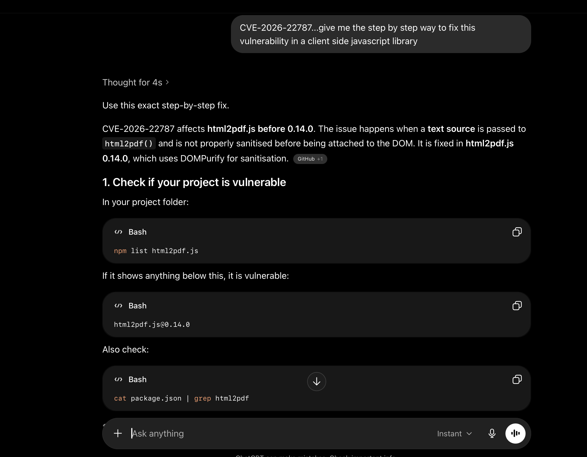

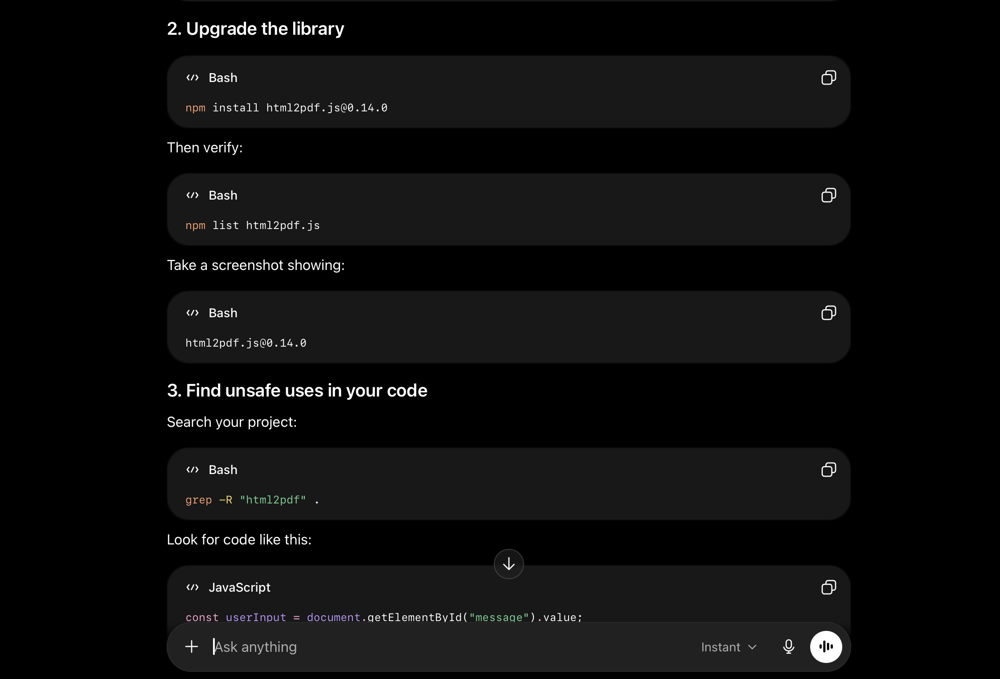

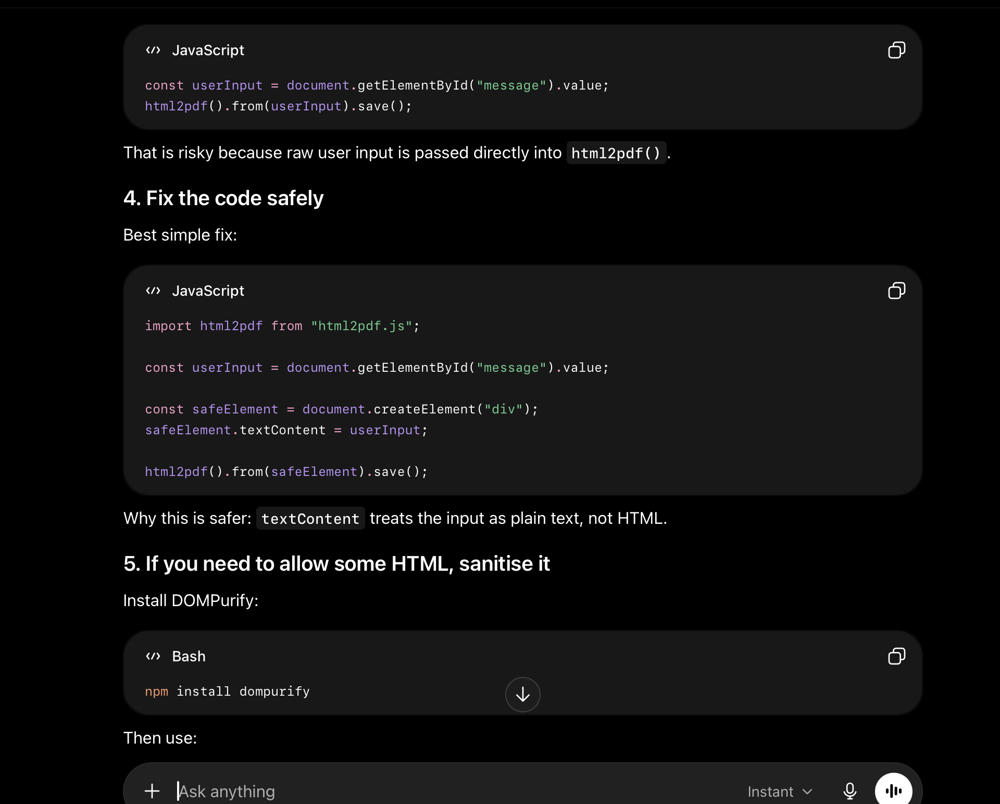

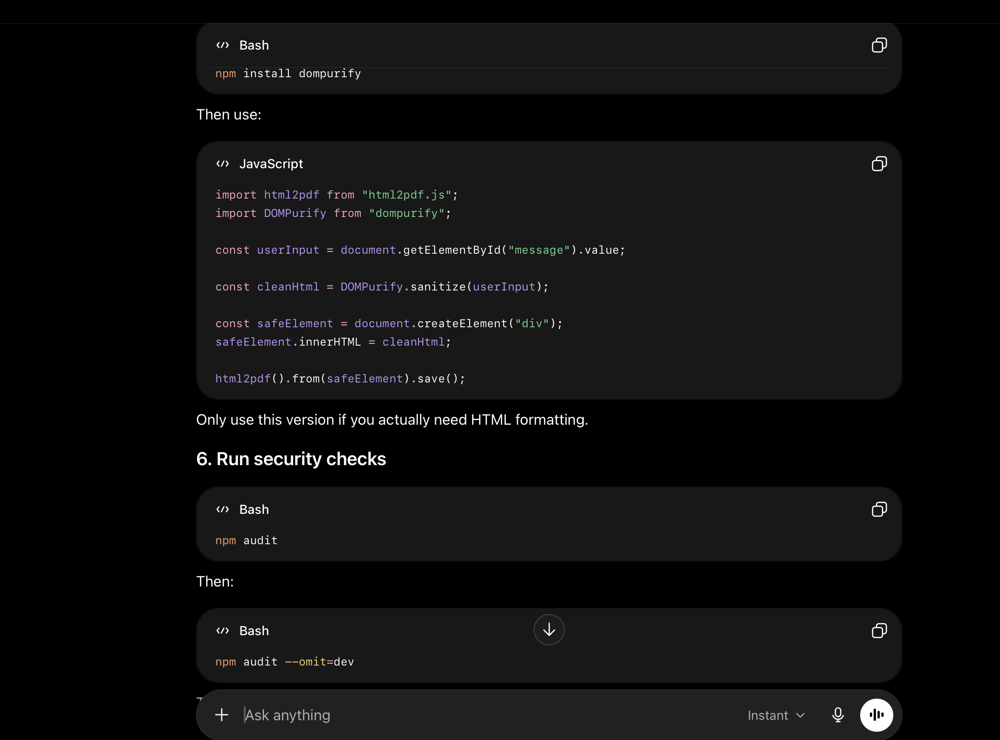

---

# AI System 2 — Claude

Claude provided the most technically detailed explanation including:
- dependency verification
- attack path explanation
- mitigation techniques
- defence-in-depth recommendations
- regression testing examples
- DOMPurify sanitisation methods
- Content Security Policy suggestions

## Evidence

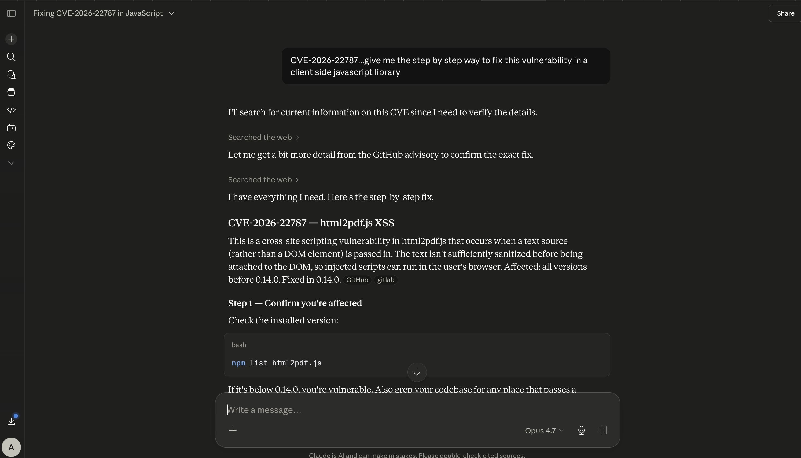

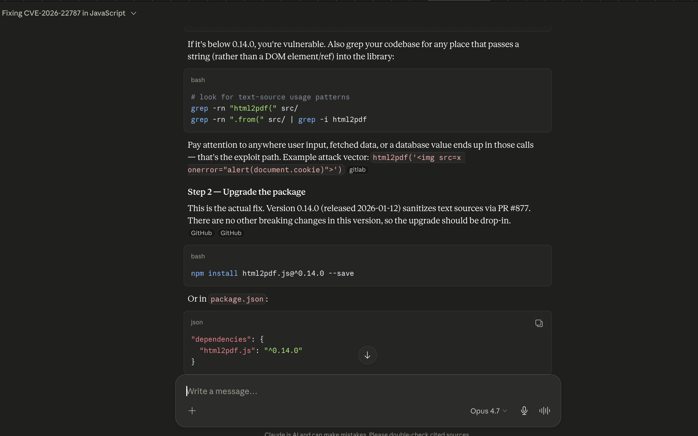

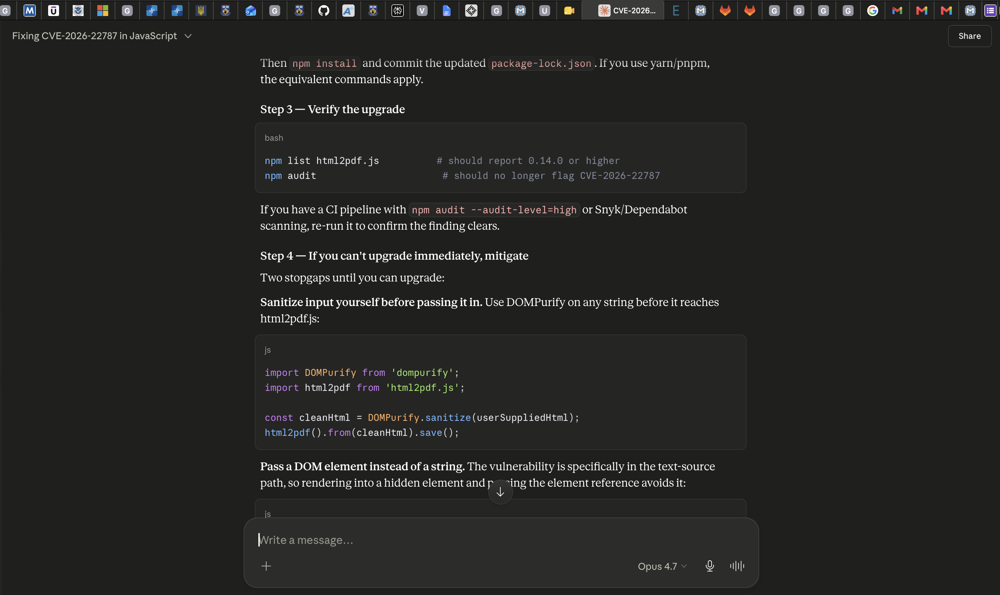

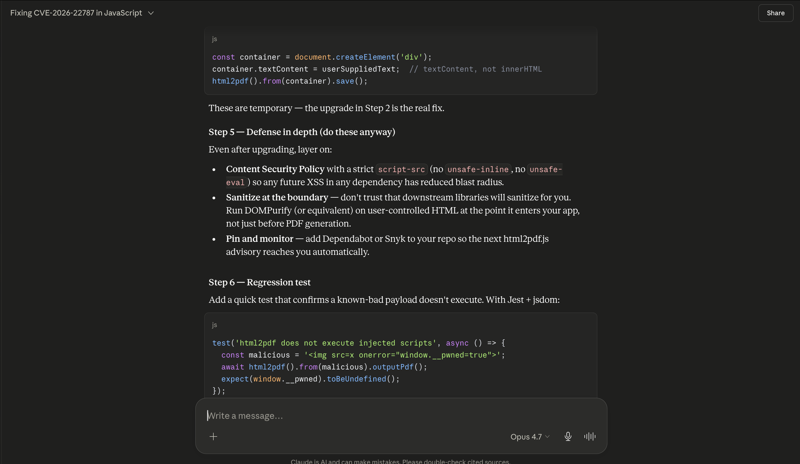

---

# AI System 3 — Gemini

Gemini provided:
- concise remediation guidance
- upgrade commands
- dependency verification
- sanitisation recommendations
- simplified explanation of the vulnerability

## Evidence

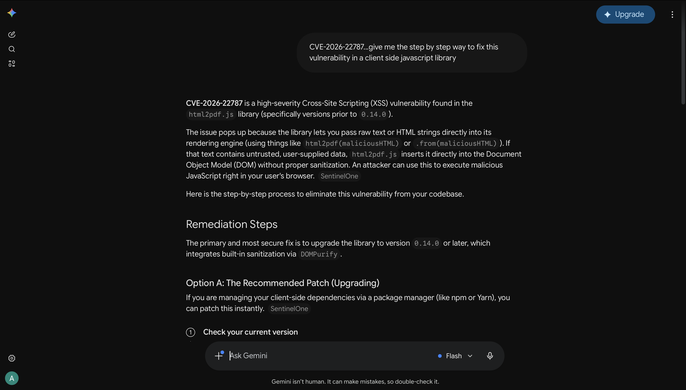

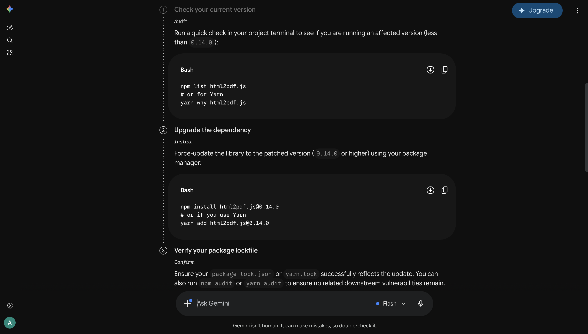


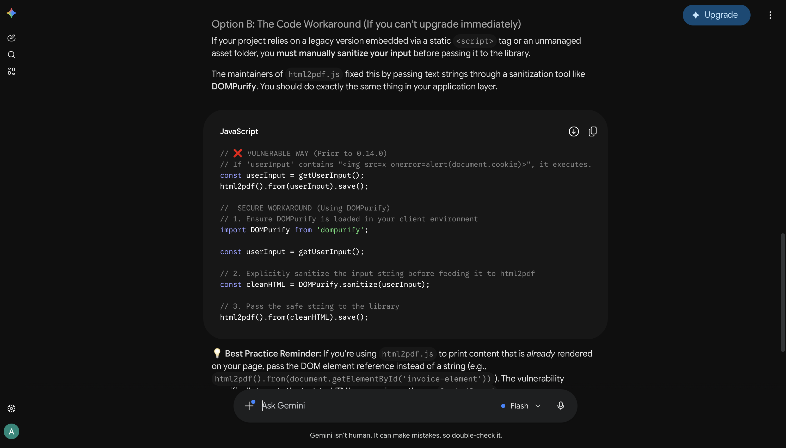

---

# Practical Testing Environment

The remediation process recommended by the AI systems was tested inside a Kali Linux environment using Node.js and npm.

---

# Step 1 — Installing the Vulnerable Version

First, the vulnerable version of html2pdf.js was installed.

Command used:

```bash
npm install html2pdf.js@0.13.0
```

The installation output reported:

```text
1 high severity vulnerability
```

This confirmed that the vulnerable dependency had been successfully reproduced for testing purposes.

## Screenshot Evidence

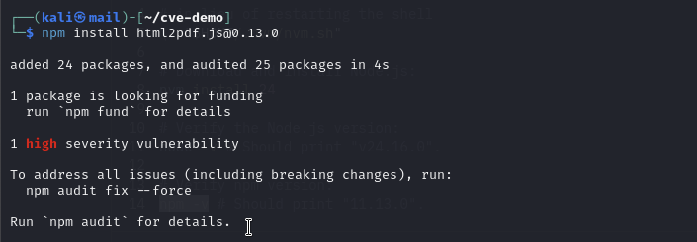

---

# Step 2 — Verifying the Vulnerability

The installed package version and security status were checked using:

```bash
npm list html2pdf.js
```

```bash
npm audit
```

The audit results confirmed the presence of the high severity vulnerability associated with html2pdf.js version 0.13.0.

---

# Step 3 — Applying the Recommended Fix

The vulnerable dependency was upgraded to the patched version recommended by all three AI systems.

Command used:

```bash
npm install html2pdf.js@0.14.0
```

Version 0.14.0 introduced improved sanitisation protections using DOMPurify.

---

# Step 4 — Verifying the Fix

After upgrading, the following commands were executed again:

```bash
npm audit
```

```bash
npm list html2pdf.js
```

The results showed:

```text
found 0 vulnerabilities
```

and verified that the installed version was:

```text
html2pdf.js@0.14.0
```

This confirmed that the vulnerability had been successfully remediated.

## Screenshot Evidence

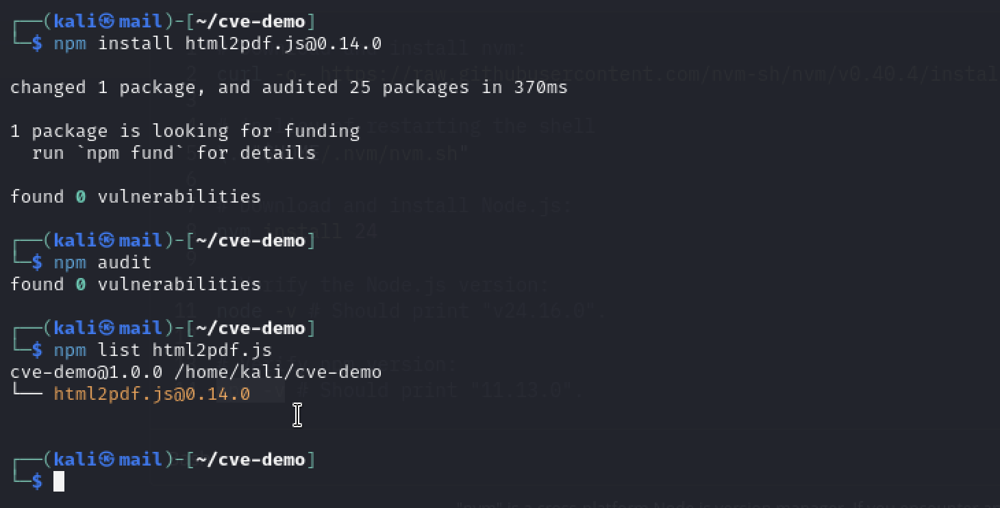

---

# Comparison of AI Responses

The three AI systems were generally highly consistent in their remediation advice.

## ChatGPT

ChatGPT provided:
- practical workflow
- clear terminal commands
- verification methods
- sanitisation examples
- beginner-friendly explanations

The response was structured and easy to follow while remaining technically accurate.

---

## Claude

Claude produced the most detailed technical explanation.

It included:
- attack path explanation
- dependency tracing
- defence-in-depth concepts
- mitigation alternatives
- regression testing
- DOMPurify implementation examples
- Content Security Policy recommendations

Claude also explained why the vulnerability occurs internally within the DOM rendering process.

---

## Gemini

Gemini gave:
- concise remediation guidance
- dependency upgrade commands
- verification steps
- sanitisation recommendations

Although shorter than the others, the remediation advice remained accurate and practical.

---

# Findings

All three AI systems consistently identified the same primary remediation strategy:

- upgrade html2pdf.js to version 0.14.0 or later
- sanitise untrusted input
- avoid passing raw HTML directly into html2pdf.js
- verify remediation using npm audit

The main differences were:
- level of detail
- depth of technical explanation
- amount of defensive security guidance provided

Claude provided the deepest technical explanation, while Gemini provided the simplest and shortest workflow.

---

# Skills and Concepts Demonstrated

This activity demonstrated:
- CVE vulnerability research
- dependency auditing
- package remediation
- XSS vulnerability understanding
- npm security auditing
- secure dependency management
- AI-assisted cybersecurity analysis
- comparative evaluation of AI-generated technical advice

---

# Conclusion

Overall, this activity successfully demonstrated the identification and remediation of CVE-2026-22787 using guidance generated by three different AI systems.

All three systems consistently recommended upgrading html2pdf.js to version 0.14.0 and sanitising user-controlled input to prevent Cross-Site Scripting attacks.

The remediation was successfully tested inside a Kali Linux environment, and npm audit confirmed that the vulnerability had been resolved after upgrading the dependency.

This activity also demonstrated that multiple modern generative AI systems can provide largely consistent and technically accurate cybersecurity remediation guidance when given the same vulnerability prompt.
